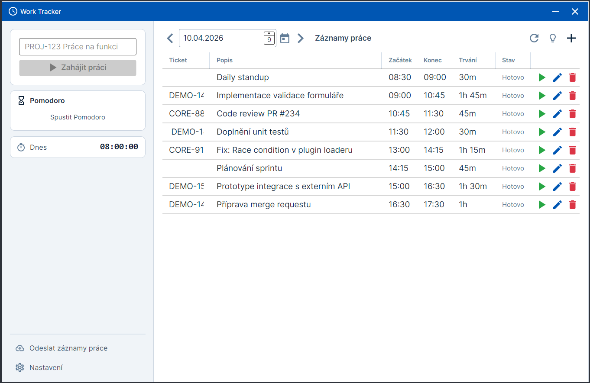

# WorkTracker

**Desktopová aplikace pro sledování pracovní doby s rozšiřitelným plugin systémem.**

[](https://github.com/vesnicancz/work-tracker/actions/workflows/dotnet.yml)
[](https://github.com/vesnicancz/work-tracker/releases/latest)
[](https://dotnet.microsoft.com/)
[](https://learn.microsoft.com/en-us/dotnet/csharp/)

[](https://learn.microsoft.com/en-us/ef/core/)
[](https://avaloniaui.net/)

---



## O projektu

WorkTracker je desktopová aplikace pro sledování času stráveného na pracovních úkolech. Je postavená na .NET 10 s Clean Architecture a nabízí tři způsoby ovládání:

- **Avalonia GUI** — moderní cross‑platform rozhraní (Windows, Linux, macOS)
- **WPF GUI** — nativní Windows aplikace s Material Design
- **CLI** — terminálový klient (Spectre.Console) pro rychlé ovládání z příkazové řádky

Jádro aplikace je rozšiřitelné pomocí pluginů, které jsou načítané z izolovaných `AssemblyLoadContext`. Pluginy pro integraci s Jirou, Tempem, Office 365 kalendářem, Goran G3 a Luxafor LED indikátorem jsou publikované jako samostatné `WorkTracker.Plugin.*.zip` balíčky — nejsou součástí runtime ZIPu aplikace, stáhni si je podle potřeby a rozbal do adresáře `plugins/` vedle spustitelného souboru.

### Hlavní funkce

- Start / stop / edit / delete pracovních záznamů s automatickou detekcí Jira ticket kódu
- Denní a týdenní přehledy, navigace „Přejít na dnešek“
- Odesílání worklogů do externích systémů s náhledem a opakovaným pokusem u selhání
- Návrhy práce (Work Suggestions) z Jira issues a kalendářových událostí
- Detekce a řešení překrývajících se časových intervalů (Unit of Work transakce)
- Pomodoro timer s OS notifikacemi a volitelnou indikací na Luxafor LED
- Oblíbené položky jako šablony pro rychlé spuštění
- System tray ikona s toggle okna klikem, notifikacemi a rychlým menu
- Automatická kontrola aktualizací
- Lokalizace (čeština, angličtina)

---

## Rychlý start

### Prerekvizity

- [.NET 10.0 SDK](https://dotnet.microsoft.com/download/dotnet/10.0)
- Git
- Jedna z podporovaných platforem:
  - Windows 10/11 — všechny tři frontendy (CLI, WPF, Avalonia)
  - Linux / macOS — CLI a Avalonia

### Naklonování a build

```bash
git clone https://github.com/vesnicancz/work-tracker.git
cd work-tracker

dotnet restore
dotnet build
dotnet test
```

### Spuštění z vývojového stromu

```bash
# CLI (cross-platform)
dotnet run --project src/WorkTracker.CLI -- help

# Avalonia (cross-platform)
dotnet run --project src/WorkTracker.Avalonia

# WPF (pouze Windows)
dotnet run --project src/WorkTracker.WPF
```

### První záznam

```bash
dotnet run --project src/WorkTracker.CLI -- start PROJ-123 "Implementace nové funkce"
dotnet run --project src/WorkTracker.CLI -- status
dotnet run --project src/WorkTracker.CLI -- stop
dotnet run --project src/WorkTracker.CLI -- list
```

Detailní průvodce prvním spuštěním a ovládáním najdeš v [docs/user-guide.md](docs/user-guide.md).

---

## CLI přehled

| Příkaz | Popis |
|--------|-------|
| `start [ticket] [popis] [čas]` | Začít sledovat práci (auto‑stop předchozího záznamu) |
| `stop [čas]` | Ukončit aktivní záznam |
| `status` | Zobrazit aktuálně běžící záznam |
| `list [datum]` | Výpis záznamů pro zadaný den (výchozí: dnes) |
| `edit <id> [--ticket=] [--start=] [--end=] [--desc=]` | Úprava existujícího záznamu |
| `delete <id>` | Smazání záznamu |
| `send [week] [datum]` | Odeslání worklogu do externího systému (náhled + potvrzení). **Pozor:** aktuální `WorkTracker.CLI` pluginy neenable-uje, takže tento příkaz v praxi skončí chybou „No worklog upload plugin available". Pro reálné odesílání použij GUI. |
| `version`, `help` | Verze a nápověda |

Příklady:

```bash
# Start s Jira kódem, popisem a explicitním časem
WorkTracker.CLI start PROJ-123 "Bug fix" 09:00

# Odeslání celého aktuálního týdne
WorkTracker.CLI send week

# Úprava záznamu č. 5
WorkTracker.CLI edit 5 --ticket=PROJ-456 --end=17:30 --desc="Nový popis"
```

> **Jak spustit binárku:** Příklady výše ukazují jen název programu. Ve skutečnosti záleží na platformě a na tom, jestli máš složku s binárkou v `PATH`:
>
> - **Windows**: `WorkTracker.CLI.exe start …` (z PowerShellu / CMD), nebo `.\WorkTracker.CLI.exe start …` z lokální složky
> - **Linux / macOS**: `./WorkTracker.CLI start …` z lokální složky, nebo `WorkTracker.CLI start …` pokud je v `PATH`
>
> **Poznámka k nápovědě:** Vestavěný help (`WorkTracker.CLI help`) používá v usage stringách historický název `worklog` (např. `Usage: worklog start [ticket-id] ...`). Je to stará relikvie — skutečná binárka se jmenuje `WorkTracker.CLI`, takže při volání nahraď `worklog` za `WorkTracker.CLI` (s `.exe`/`./` dle platformy).

Jira ticket se detekuje automaticky z prvního tokenu, který odpovídá regex vzoru `^([a-zA-Z0-9]+-[0-9]+)` (ověřeno v `JiraPatterns.TicketId()`). Prefix před pomlčkou může obsahovat písmena i číslice, povoluje velká i malá písmena (char class `[a-zA-Z]`, ne `RegexOptions.IgnoreCase`), ale **nepovoluje underscore** — např. `PROJ-123` nebo `proj-123` fungují, `WORK_TRACKER-42` ne. Časy lze zadávat ve formátech `HH:mm`, `HH:mm:ss` nebo `yyyy-MM-dd HH:mm`.

---

## Konfigurace

### Umístění dat

Aplikace ukládá všechna perzistentní data do `%LocalAppData%\WorkTracker\` (Windows), resp. `~/.local/share/WorkTracker/` (Linux) nebo `~/Library/Application Support/WorkTracker/` (macOS).

> **Environment suffix:** Pokud běží v non‑Production prostředí (proměnná `DOTNET_ENVIRONMENT` nebo `ASPNETCORE_ENVIRONMENT` != `Production`), přidá se k názvu složky suffix — `WorkTracker_Development` pro development a podobně. Při `dotnet run` z vývojového stromu je výchozí prostředí `Development`, takže reálná cesta bývá `%LocalAppData%\WorkTracker_Development\`. V release buildu (publikovaná binárka bez přepisu env proměnné) se používá čisté `WorkTracker`.

Obsah složky:

```
WorkTracker/
├── worktracker.db          # SQLite databáze (automaticky migrováno)
├── settings.json           # Uživatelské nastavení (pluginy, téma, Pomodoro…)
├── logs/                   # Serilog (rolling denně, 14 souborů)
└── keys/                   # MSAL token cache (standardně šifrovaná OS keystoreem; na některých Linux instalacích může spadnout na nešifrovanou cache — viz warning v logu)
```

Vlastní cestu k databázi lze přepsat v `appsettings.json`:

```json
{
  "Database": {
    "Path": "D:\\moje-data\\worktracker.db"
  }
}
```

### Nastavení pluginů

Pluginy se konfigurují přímo v GUI aplikaci (**Settings → Plugins**). Každý plugin vystavuje seznam polí (`PluginConfigurationField`), pro která UI vygeneruje odpovídající formulář a validuje vstup.

Citlivé údaje (API tokeny, hesla) aplikace ukládá přes `ISecureStorage` do systémového credential storu:

- **Windows** — Credential Manager (DPAPI)
- **macOS** — Keychain
- **Linux** — libsecret / GNOME Keyring

V souboru `settings.json` je na jejich místě uložený pouze placeholder `CS:{pluginId}:{fieldKey}`, nikdy plaintext. OAuth tokeny pro pluginy používající MSAL (Office 365 Calendar, Goran G3) jsou v zašifrované cache v `keys/` a při vypršení se obnovují přes **device code flow**.

> **Pluginy v CLI:** Aktuální `WorkTracker.CLI` volá `InitializePluginsAsync` bez enabled‑plugin mapy, takže v CLI **zůstanou všechny pluginy vypnuté** a příkaz `send` skončí s „No worklog upload plugin available". Konfigurace pluginů se tedy reálně dělá jen v GUI (Avalonia / WPF → **Nastavení → Pluginy**). Jednotlivé plugin docs v [docs/plugins/](docs/plugins/) obsahují ukázkové `appsettings.json` schéma pluginu jako referenci pro integrátory s vlastním hostem, ne jako funkční CLI fallback.

> **Bezpečnost:** Necommituj API tokeny do Gitu.

---

## Plugin systém

WorkTracker podporuje tři typy pluginů:

| Typ | Rozhraní | Účel |
|-----|----------|------|
| **Worklog Upload** | `IWorklogUploadPlugin` | Odesílání a načítání worklogů z externích systémů |
| **Work Suggestion** | `IWorkSuggestionPlugin` | Návrhy úkolů (issues, kalendářové události) |
| **Status Indicator** | `IStatusIndicatorPlugin` | Ovládání fyzických indikátorů stavu (LED apod.) |

### Dodávané pluginy

| Plugin | Popis | Dokumentace |
|--------|-------|-------------|
| **Atlassian** | Tempo upload worklogů + Jira suggestions (sdílený `JiraClient`) | [docs/plugins/atlassian.md](docs/plugins/atlassian.md) |
| **Office 365 Calendar** | Work suggestions z kalendářových událostí (MSAL device code) | [docs/plugins/office365-calendar.md](docs/plugins/office365-calendar.md) |
| **Goran G3** | Upload worklogů přes MCP server s Entra ID autentizací | [docs/plugins/goran-g3.md](docs/plugins/goran-g3.md) |
| **Luxafor** | Zobrazení Pomodoro fáze na Luxafor Bluetooth Pro LED | [docs/plugins/luxafor.md](docs/plugins/luxafor.md) |

### Vlastní plugin

```csharp
using Microsoft.Extensions.Logging;
using WorkTracker.Plugin.Abstractions;

public sealed class MujPlugin : WorklogUploadPluginBase
{
    public MujPlugin(ILogger<MujPlugin> logger) : base(logger) { }

    public override PluginMetadata Metadata => new()
    {
        Id = "muj.worklog",
        Name = "Můj Plugin",
        Version = new Version(1, 0, 0),
        Author = "Já",
    };

    public override IReadOnlyList<PluginConfigurationField> GetConfigurationFields() => [];

    public override Task<PluginResult<bool>> TestConnectionAsync(
        IProgress<string>? progress, CancellationToken ct) =>
        Task.FromResult(PluginResult<bool>.Success(true));

    public override Task<PluginResult<bool>> UploadWorklogAsync(
        PluginWorklogEntry worklog, CancellationToken ct)
    {
        // …vlastní logika nahrání…
        return Task.FromResult(PluginResult<bool>.Success(true));
    }

    // GetWorklogsAsync, WorklogExistsAsync…
}
```

Kompletní návod: [docs/plugin-development.md](docs/plugin-development.md).

---

## Architektura

Clean Architecture s jednosměrnými závislostmi:

```
Presentation (CLI, WPF, Avalonia)
      └─ UI.Shared (ViewModels, Orchestrátory, ISettingsService, ILocalizationService)
            └─ Application (IWorkEntryService, IUnitOfWork, Result<T>, DTOs)
                  └─ Domain (WorkEntry, IWorkEntryRepository, business pravidla)

Plugin.Abstractions (IPlugin, *PluginBase) — společné API pro všechny pluginy
      └─ referencováno z Application, Infrastructure a jednotlivých plugin projektů
```

Viz [docs/architecture.md](docs/architecture.md) pro detailní diagram, popis vrstev a vzorů (Result pattern, Unit of Work, plugin DI scope).

### Projekty v repozitáři

```
work-tracker/
├── src/
│   ├── WorkTracker.Domain/               # Business entity a pravidla
│   ├── WorkTracker.Application/          # Use cases, služby, interfaces
│   ├── WorkTracker.Infrastructure/       # EF Core, SQLite, PluginManager, MSAL
│   ├── WorkTracker.UI.Shared/            # Sdílené ViewModely a služby
│   ├── WorkTracker.CLI/                  # Spectre.Console klient
│   ├── WorkTracker.WPF/                  # WPF GUI (Windows)
│   ├── WorkTracker.Avalonia/             # Avalonia GUI (cross-platform)
│   └── WorkTracker.Plugin.Abstractions/  # Plugin API
├── plugins/
│   ├── WorkTracker.Plugin.Atlassian/         # Tempo + Jira Suggestions
│   ├── WorkTracker.Plugin.Office365Calendar/ # O365 Calendar suggestions
│   ├── WorkTracker.Plugin.GoranG3/           # Goran G3 worklog upload
│   └── WorkTracker.Plugin.Luxafor/           # Luxafor LED status
├── tests/                                # xUnit + Moq + FluentAssertions
└── docs/                                 # Dokumentace (tento soubor je odkazy sem)
```

---

## Dokumentace

- **[Uživatelská příručka](docs/user-guide.md)** — CLI i GUI tutoriál, první spuštění, troubleshooting
- **[Architektura](docs/architecture.md)** — vrstvy, DI, Result pattern, Unit of Work
- **[Vývojářská příručka](docs/developer-guide.md)** — setup, build, testy, migrace, konvence
- **[Plugin Development](docs/plugin-development.md)** — jak napsat vlastní plugin
- **[Pluginy](docs/plugins/)** — konfigurační reference pro dodávané pluginy

---

## Přispívání

1. Forkni repozitář
2. Vytvoř feature branch (`git checkout -b feature/nova-funkce`)
3. Dodržuj coding standards ([docs/developer-guide.md](docs/developer-guide.md)), přidej testy
4. Commit + push, otevři Pull Request proti `master`

Při hlášení bugu uveď verzi aplikace (`WorkTracker.CLI version`), OS, .NET verzi, kroky k reprodukci a přiložené logy z `%LocalAppData%\WorkTracker\logs\`.

## Kontakt

- [GitHub Issues](https://github.com/vesnicancz/work-tracker/issues)
- [GitHub Discussions](https://github.com/vesnicancz/work-tracker/discussions)
