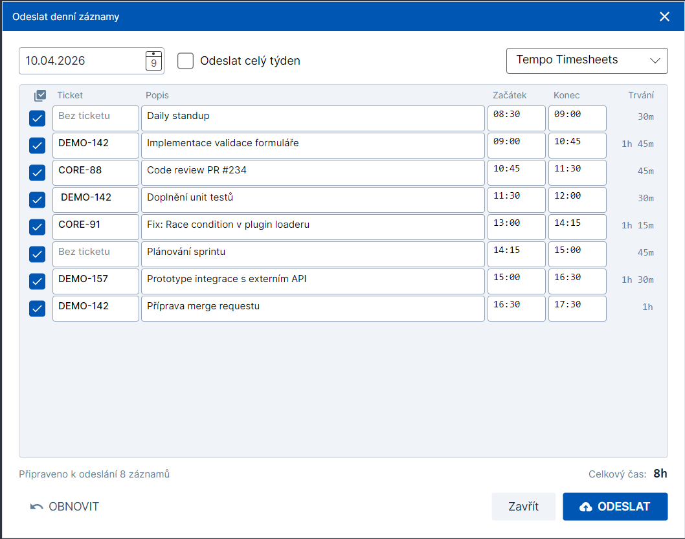

# Uživatelská příručka

Průvodce ovládáním WorkTrackeru od prvního spuštění až po pokročilé funkce. Pokud hledáš stručný přehled, začni v [README.md](../README.md).

---

## Obsah

1. [Instalace](#instalace)
2. [První spuštění](#první-spuštění)
3. [Umístění dat](#umístění-dat)
4. [CLI](#cli)
5. [Avalonia GUI](#avalonia-gui)
6. [WPF GUI](#wpf-gui)
7. [Konfigurace pluginů](#konfigurace-pluginů)
8. [Work Suggestions](#work-suggestions)
9. [Odesílání worklogů](#odesílání-worklogů)
10. [Pomodoro](#pomodoro)
11. [Oblíbené položky](#oblíbené-položky)
12. [System tray a notifikace](#system-tray-a-notifikace)
13. [Lokalizace a motivy](#lokalizace-a-motivy)
14. [Automatické aktualizace](#automatické-aktualizace)
15. [Řešení problémů](#řešení-problémů)

---

## Instalace

### Z GitHub Releases (doporučeno)

Na stránce [Releases](https://github.com/vesnicancz/work-tracker/releases/latest) jsou k dispozici předem připravené balíčky pro všechny podporované platformy:

| Balíček | Obsah | Podporované RID |
|---------|-------|-----------------|
| `WorkTracker-CLI-{rid}.zip` | Konzolová aplikace | `win-x64`, `linux-x64`, `osx-x64`, `osx-arm64` |
| `WorkTracker-Avalonia-{rid}.zip` | Cross‑platform GUI | `win-x64`, `win-arm64`, `linux-x64`, `osx-x64`, `osx-arm64` |
| `WorkTracker-WPF-win-x64.zip` | WPF GUI (pouze Windows) | `win-x64` |
| `WorkTracker.Plugin.{Name}.zip` | Platformně neutrální pluginy (Atlassian, GoranG3, Luxafor, Office365Calendar) | — |

**Postup:**

1. Stáhni si balíček pro svůj operační systém a architekturu.
2. Rozbal do libovolné složky.
3. Chceš‑li pluginy, rozbal je do podsložky `plugins/` vedle spustitelného souboru.
4. Spusť aplikaci — databáze i nastavení se vytvoří automaticky při prvním startu.

Balíčky jsou framework‑dependent (není zahrnutý .NET runtime). Je potřeba mít nainstalovaný **.NET 10 Runtime** (pro CLI stačí runtime, pro GUI je potřeba Desktop Runtime).

### Build ze zdrojových kódů

```bash
git clone https://github.com/vesnicancz/work-tracker.git
cd work-tracker

dotnet publish src/WorkTracker.Avalonia -c Release -r win-x64 --self-contained false
dotnet publish src/WorkTracker.CLI      -c Release -r win-x64 --self-contained false
```

Publikované soubory najdeš v `src/<Projekt>/bin/Release/net10.0/<rid>/publish/`.

RID (runtime identifier) si zvol podle své platformy: `win-x64`, `win-arm64`, `linux-x64`, `osx-x64`, `osx-arm64`.

---

## První spuštění

Při prvním startu aplikace:

1. Vytvoří se adresář s uživatelskými daty (`%LocalAppData%\WorkTracker\` na Windows).
2. Proběhne migrace SQLite databáze (`worktracker.db`).
3. Načtou se zabudované pluginy + pluginy ze složky `./plugins/` vedle binárky.
4. Pokud některý plugin nemá nastavenou konfiguraci, zůstane v seznamu, ale nebude aktivní.

Doporučený postup pro nového uživatele:

1. Spusť Avalonia (nebo WPF) GUI.
2. Otevři **Settings** (ozubené kolečko v pravém horním rohu nebo menu).
3. Nakonfiguruj pluginy, které chceš používat — viz [Konfigurace pluginů](#konfigurace-pluginů).
4. Nastav Pomodoro, téma a lokalizaci podle chuti.
5. Vytvoř si první záznam (tlačítko **Start** nebo `Ctrl+Shift+W`).

---

## Umístění dat

WorkTracker používá pro všechna perzistentní data jednu složku podle OS:

| OS | Cesta |
|----|-------|
| Windows | `%LocalAppData%\WorkTracker\` (např. `C:\Users\Pepa\AppData\Local\WorkTracker\`) |
| Linux | `$XDG_DATA_HOME/WorkTracker/` nebo `~/.local/share/WorkTracker/` |
| macOS | `~/Library/Application Support/WorkTracker/` |

Obsah:

```
WorkTracker/
├── worktracker.db              SQLite databáze (automaticky migrovaná)
├── settings.json               Uživatelské nastavení (pluginy, téma, Pomodoro…)
├── logs/
│   ├── worktracker-YYYYMMDD.log     Logy GUI aplikace
│   └── worktracker-cli-YYYYMMDD.log Logy CLI
└── keys/                       MSAL token cache (šifrovaná OS keystoreem)
```

Logy se rotují denně, uchovává se posledních **14 souborů**. Citlivá data (API tokeny) v `settings.json` **nejsou** v plaintextu — jsou nahrazena placeholderem `CS:{pluginId}:{fieldKey}` a skutečná hodnota je v systémovém credential storu.

Pokud potřebuješ data přenést na jiný stroj, zkopíruj celou tuto složku. Pozor: tokeny uložené v OS credential storu se **nekopírují** — bude potřeba je znovu zadat (nebo se znovu přihlásit přes device code flow).

### Přepis cesty k databázi

Pro CLI lze cestu k databázi přepsat v `appsettings.json`:

```json
{
  "Database": {
    "Path": "D:\\zaloha\\worktracker.db"
  }
}
```

---

## CLI

CLI klient se jmenuje `WorkTracker.CLI` (při vývoji spouštěn jako `dotnet run --project src/WorkTracker.CLI --`).

### Přehled příkazů

```
WorkTracker.CLI <command> [args]

start [ticket-id] [popis] [čas]    Začít nový záznam
stop  [čas]                        Ukončit aktivní záznam
status                             Zobrazit aktivní záznam
list  [datum]                      Výpis záznamů za den
edit  <id> [options]               Upravit existující záznam
delete <id>                        Smazat záznam
send  [week] [datum]               Odeslat worklog do externího systému
version                            Verze aplikace
help                               Tato nápověda
```

### Parsování `start`

Příkaz `start` je volnější — akceptuje různé kombinace:

```bash
WorkTracker.CLI start PROJ-123
WorkTracker.CLI start PROJ-123 "Bug fix v autentizaci"
WorkTracker.CLI start PROJ-123 "Bug fix" 09:00
WorkTracker.CLI start "Standup meeting"
WorkTracker.CLI start "Standup meeting" "2026-04-09 09:00"
```

Logika:

- Pokud první token odpovídá regex vzoru `[A-Z][A-Z0-9_]+-\d+`, považuje se za **ticket ID** (např. `PROJ-123`, `WORK_TRACKER-42`).
- Poslední token je zkontrolován, zda nejde o čas (`HH:mm`, `HH:mm:ss`, nebo `yyyy-MM-dd HH:mm`). Pokud ano, je to `start time`. Jinak je součástí popisu.
- Zbytek je popis práce.
- Validace: **musí být zadán alespoň ticket ID nebo popis.**

Pokud je aktivní jiný záznam, automaticky se zastaví na začátku nového (v rámci jedné transakce).

### `stop`

```bash
WorkTracker.CLI stop             # konec = teď
WorkTracker.CLI stop 17:30       # konec = dnes 17:30
WorkTracker.CLI stop "2026-04-09 17:30"
```

Pokud žádný záznam není aktivní, vypíše upozornění a vrátí exit code `1` (tedy ho můžeš ve skriptu detekovat jako „nic se nestalo").

### `status`

Zobrazí tabulku s ID, ticketem, popisem, startem a doposud uběhlou dobou aktuálně běžícího záznamu:

```bash
WorkTracker.CLI status
```

### `list`

```bash
WorkTracker.CLI list              # dnes
WorkTracker.CLI list 2026-04-08   # konkrétní den
```

Vrací tabulku se záznamy za daný den včetně celkového času.

### `edit`

```bash
WorkTracker.CLI edit 5 --ticket=PROJ-456
WorkTracker.CLI edit 5 --start=09:00 --end=17:30
WorkTracker.CLI edit 5 --desc="Nový popis"
WorkTracker.CLI edit 5 --start="2026-04-09 09:00" --end="2026-04-09 17:30"
```

Nezadané parametry zůstávají nezměněny. Pokud se nové časy překrývají s jiným existujícím záznamem, aplikace se pokusí kolizi vyřešit (ořez nebo smazání kolidujícího záznamu) — akce běží v `IUnitOfWork` transakci, takže se buď povede celá, nebo nic.

### `delete`

```bash
WorkTracker.CLI delete 5
```

### `send`

```bash
WorkTracker.CLI send                    # dnes
WorkTracker.CLI send 2026-04-08         # konkrétní den
WorkTracker.CLI send week               # aktuální týden
WorkTracker.CLI send week 2026-04-08    # týden obsahující dané datum
```

Postup:

1. Aplikace načte záznamy z databáze pro zvolený rozsah.
2. Ukáže náhled v tabulce (ticket, start, konec, délka).
3. Požádá o potvrzení — **`y/N`**.
4. Zavolá první nakonfigurovaný `IWorklogUploadPlugin`. Pokud máš více worklog pluginů, použije se první podle **interního pořadí načtení / povolení** (ne abecedně); pro výběr konkrétního pluginu použij GUI.
5. U týdenního odesílání se při částečném úspěchu vypíše seznam selhaných dnů a důvody.

Neúplné záznamy (bez ticketu i popisu, nebo s nulovou délkou) jsou pluginem validátorem automaticky odfiltrovány s upozorněním.

---

## Avalonia GUI

Cross‑platform desktopová aplikace. Hlavní okno je rozdělené na **levý postranní panel** s rychlými akcemi a **pravou hlavní plochu** se seznamem záznamů.

### Hlavní okno


**Levý postranní panel** (shora dolů):

- **Karta rychlého startu** — jednořádkový textbox s placeholderem ve tvaru `PROJ-123 Práce na funkci` a tlačítko **Zahájit práci**. Stejná parsovací logika jako v CLI `start`: pokud text začíná Jira kódem (`[A-Z][A-Z0-9_]+-\d+`), rozpozná se jako ticket; zbytek je popis. Tlačítko je aktivní, když je textbox neprázdný. Pokud už jiný záznam běží, automaticky se na začátku nového zastaví.
- **Karta Pomodoro** — tlačítko **Spustit Pomodoro** (když neběží) / **Zastavit Pomodoro** a zbývající čas (když běží). Konfigurace fází je v **Nastavení → Pomodoro**.
- **Karta Dnes** — celkový čas odpracovaný za dnešek ve formátu `HH:MM:SS`, aktualizovaný v reálném čase.
- **Spodní sekce** (oddělená linkou):
  - **Odeslat záznamy práce** — otevře dialog s náhledem worklogu a výběrem pluginu pro odeslání.
  - **Nastavení** — otevře Settings okno.

**Pravá plocha — Záznamy práce:**

- **Navigace datem** (horní lišta): `<` předchozí den, **date picker** s aktuálně zobrazeným datem, **kalendářová ikona** (skok na dnešek), `>` následující den. Vpravo od navigace je titulek **Záznamy práce**.
- **Ikony vpravo nahoře**:
  - ↻ **Refresh** — znovu načte záznamy za zvolený den.
  - 💡 **Návrhy** (žárovka) — otevře dialog Work Suggestions (viz [Work Suggestions](#work-suggestions)).
  - `+` **Nový záznam** — otevře dialog pro ruční vytvoření záznamu s plnými poli (ticket, popis, začátek, konec).
- **Datagrid** se sloupci:
  - **Ticket** — Jira kód záznamu (nebo prázdné)
  - **Popis**
  - **Začátek** — čas startu (`HH:mm`)
  - **Konec** — čas ukončení (`HH:mm`, prázdné u aktivního záznamu)
  - **Trvání** — délka záznamu
  - **Stav** — indikátor aktivní / dokončený
  - **Akce** (poslední úzký sloupec) — tlačítka nad každým řádkem:
    - ▶ **Spustit znovu** — zahájí nový záznam se stejným ticketem a popisem (rychlý restart z historie). U aktivního záznamu se toto tlačítko nezobrazuje.
    - ✎ **Upravit** — otevře dialog editace záznamu.
    - 🗑 **Smazat** — odstraní záznam.

Dvojklik na řádek otevře dialog editace záznamu.

**Klávesová zkratka:** `Ctrl+Shift+W` pro vytvoření nového work itemu.

### Okno Nastavení

Otevírá se kliknutím na **Nastavení** v levém dolním rohu hlavního okna. Dialog má pět záložek:

**Obecné** — základní chování aplikace:

- **Chování okna** — dvě volby pro to, co se stane po zavření okna: **Minimalizovat do systémové lišty** (aplikace běží dál v tray) nebo **Ukončit aplikaci** (standard close).
- **Spuštění**:
  - **Spustit s Windows** — zaregistruje aplikaci do autostart.
  - **Spustit minimalizovanou** — okno se při startu neobjeví, aplikace jede rovnou do tray.
- **Aktualizace** — **Kontrolovat aktualizace** zapíná/vypíná periodickou kontrolu GitHub Releases.
- **Vzhled** — dropdown **Motiv** s volbou mezi Modern Blue, Dark, Light, Midnight a Purple.

**Oblíbené** — správa oblíbených položek (viz [Oblíbené položky](#oblíbené-položky)):

- Seznam existujících oblíbených s tlačítky pro odstranění a posun nahoru/dolů.
- Formulář pro přidání/editaci s poli **Název**, **Ticket**, **Popis** a checkboxem **Zobrazit jako šablonu** (určuje, zda se položka zobrazí v quick menu).

**Pomodoro**:

- Checkbox **Zapnuto** aktivuje Pomodoro timer.
- Čtyři numerická pole: délka **Práce**, **Krátké pauzy**, **Dlouhé pauzy** a **Počet pomodor před dlouhou pauzou**.
- Checkboxy **Automaticky spouštět tracking** a **Automaticky zastavovat tracking** pro napojení Pomodoro fází na work entry tracking.

**Pluginy**:

- Dropdown s výběrem pluginu (místo seznamu). Po výběru se dole zobrazí:
  - Checkbox **Enabled** / **Disabled**.
  - **Konfigurační formulář** — dynamicky generovaný z `PluginConfigurationField` daného pluginu. Pole typu `Password` se ukládají do secure storage.
  - Tlačítko **Test connection** (u pluginů implementujících `ITestablePlugin`) s textovým výstupem výsledku.
- Pokud nejsou nalezené žádné pluginy, záložka zobrazí zprávu „No plugins available“.

**O aplikaci**:

- Název aplikace a **verze** (`AppInfo.DisplayVersion`).
- **Klávesové zkratky**:
  - `Ctrl + Shift + W` — globální hotkey pro rychlé vytvoření work itemu (funguje i když okno není v popředí).
  - `Enter` — v textboxu rychlého startu potvrdí a spustí záznam.
- **Rychlý přehled** — bullet seznam základních funkcí (jak začít trackovat, formát Jira kódu, k čemu jsou oblíbené, odesílání worklogů, system tray).
- **System Info** — runtime verze (.NET), platforma (OS), UI framework.

Dole jsou tlačítka **Zrušit** a **Uložit**. Změny se projeví až po uložení.

### Dialog vytvoření a úpravy záznamu

Stejný dialog se používá pro **vytvoření nového záznamu** (tlačítko `+` v toolbaru, `Ctrl+Shift+W`) i pro **editaci existujícího** (ikona ✎ v akcích, dvojklik na řádek). V hlavičce má odpovídající titulek.

**Pole formuláře** (seshora dolů):

- **Ticket ID** — textbox, volitelné, max 50 znaků. Placeholder naznačuje formát Jira kódu.
- **Popis** — víceřádkový textbox, volitelný, max 500 znaků. Přijímá Enter pro nové řádky, automaticky se zalamuje.
- **Začátek** — datum (date picker) + čas (textbox `HH:mm` v monospace fontu, 80 px široký). Oba prvky vedle sebe.
- **Nastavit konec** — checkbox. Když je **odznačený**, záznam se uloží jako **aktivní** (běžící, bez konce). Když je označený, rozbalí se pod ním:
  - **Konec** — stejná dvojice (datum + čas) jako u začátku.
- **Validační chyba** — červený text pod poli, pokud ViewModel odmítne data (např. konec dřív než začátek, neplatný formát času, kolize s jiným aktivním záznamem). Nezobrazí se, dokud validace neprojde přes tlačítko **Uložit**.

**Tlačítka dole** (v pravém dolním rohu):

- **Zrušit** — zavře dialog bez uložení.
- **Uložit** (s ikonou diskety, primary) — spustí validaci, a pokud projde, uloží záznam a zavře dialog.

Validace „alespoň ticket nebo popis“ platí i tady — prázdný záznam bez ticketu a popisu projde textboxy, ale `WorkEntryService` ho při uložení odmítne a chybu dialog zobrazí jako validační hlášku.

### Dialog návrhů práce (Suggestions)

Viz [Work Suggestions](#work-suggestions).

### Dialog odeslání záznamů



Otevře se po stisku **Odeslat záznamy práce** (v levém panelu dole).

**Horní panel s volbami** (tři kontroly vedle sebe):

- **Date picker** — vybrané datum (výchozí: dnes).
- **Checkbox „Odeslat celý týden“** — přepne mezi denním a týdenním režimem. V týdenním režimu dialog zobrazí záznamy seskupené podle dnů s barevně zvýrazněnými date headery.
- **Dropdown s pluginem** (vpravo) — vybere provider, kam se záznamy odešlou (např. „Tempo Timesheets“). Placeholder „Submit to…“ se zobrazí, dokud nic nevybereš.

**Seznam záznamů k odeslání** je editovatelný — můžeš upravit hodnoty předtím, než je předáš pluginu. Každý řádek obsahuje:

- **Checkbox** na začátku — odznačením záznam vyloučíš z odeslání. Checkbox v hlavičce sloupce reaguje na dva gesty: **jednoklik invertuje výběr** (označené → neoznačené a naopak), **dvojklik označí všechny**.
- **Ticket**, **Popis**, **Začátek**, **Konec** — všechny čtyři sloupce jsou textboxy, hodnoty můžeš přímo přepsat.
- **Trvání** (vpravo) — pouze pro zobrazení, přepočítává se automaticky z časů.
- Záznamy s validační chybou mají červený rámeček; tooltip ukazuje důvod.

> **Změny v dialogu se do databáze nepropisují.** Upravené hodnoty putují jen do pluginu při stisku **Odeslat** — původní záznamy v hlavním seznamu zůstanou beze změn. Tlačítkem **Obnovit** kdykoli vrátíš všechny úpravy zpátky na původní hodnoty z DB. Pokud chceš změnit záznam trvale, uprav ho v hlavním okně (ikona ✎ v akcích nebo dvojklikem na řádek).

Během načítání preview je místo seznamu vidět progress bar s textem „Načítám náhled…“.

**Status bar** pod seznamem:

- Vlevo: stavová zpráva (např. počet vybraných záznamů, výsledek posledního submitu).
- Vpravo: **Odečtený čas** — součet délky vybraných záznamů ve formátu `Xh Ym`, výrazně zvýrazněný.

**Tlačítka dole:**

- **Obnovit** (vlevo, s ikonou undo) — vrátí všechny editace zpátky na původní hodnoty (tooltip: „Obnovit původní hodnoty“).
- **Zavřít** — zruší dialog bez odeslání.
- **Opakovat neúspěšné** — zobrazí se **pouze** tehdy, když po prvním odeslání část záznamů selhala. Retryne upload jen pro neúspěšné položky.
- **Odeslat** (primary tlačítko s ikonou cloud upload) — zahájí upload. Během odesílání se mění na „Odesílám…“ s progress barem.

---

## WPF GUI

Pouze Windows. Funkčnost je prakticky totožná s Avalonia — stejné orchestrátory, stejné ViewModely (platform‑specific wrappery nad sdílenou logikou v `UI.Shared`), jen vizuálně na bázi **Material Design in XAML Toolkit**.

Spustit:

```bash
dotnet run --project src/WorkTracker.WPF
```

WPF je udržované především z důvodu hlubší integrace s Windows (system tray přes `Hardcodet.NotifyIcon.Wpf`). Pro nová nasazení preferujeme Avalonia.

---

## Konfigurace pluginů

Pluginy se konfigurují v GUI přes **Settings → Plugins**. Každý plugin vystavuje seznam polí (`PluginConfigurationField`), pro která aplikace vygeneruje formulář.

### Typy polí

| Typ | Vzhled | Příklad |
|-----|--------|---------|
| `Text` | Textbox | Jira email, project code |
| `Password` | Textbox se skrytou hodnotou, ukládáno do secure storage | API token |
| `Url` | Textbox s URL validací | `https://api.tempo.io/4` |
| `Number` | Numerický input | `MaxResults` |
| `Email` | Textbox s email validací | Jira login email |
| `MultilineText` | Textarea | JQL filtr |
| `Checkbox` | Checkbox | `IncludeAllDayEvents` |
| `Dropdown` | Combo box | Předvolené hodnoty |

### Secure storage

Pole typu `Password` (a API tokeny obecně) se **nikdy** neukládají v plaintextu v `settings.json`. Místo toho:

1. Plaintext zadáš do formuláře.
2. `CredentialStoreSecureStorage` zavolá `Protect(hodnota, pluginId, fieldKey)`.
3. Skutečná hodnota se uloží do OS credential storu s targetem `worktracker://{pluginId}/{fieldKey}`.
4. V `settings.json` zůstane jen placeholder `CS:{pluginId}:{fieldKey}`.

Při čtení se placeholder transparentně nahradí skutečnou hodnotou. Když plugin smažeš nebo změníš token, starý záznam z credential storu se odstraní přes `Remove(pluginId, fieldKey)`.

| OS | Kde najdeš uložené tokeny |
|----|--------------------------|
| Windows | Credential Manager → Windows Credentials → položky s prefixem `worktracker://` |
| macOS | Keychain Access → přihlašovací klíčenka → hledat „worktracker“ |
| Linux | Seahorse / `secret-tool search service worktracker` |

### OAuth pluginy (MSAL device code flow)

Pluginy, které autentizují uživatele přes Microsoft Entra ID (Office 365 Calendar, Goran G3), používají **device code flow**:

1. V Settings → Plugins klikneš na **Test connection**.
2. Plugin zavolá `AcquireTokenInteractiveAsync`, který spustí MSAL device code flow.
3. V progress dialogu se objeví user code a URL (např. `https://microsoft.com/devicelogin`).
4. Aplikace se současně pokusí otevřít browser. Zadáš code a přihlásíš se.
5. MSAL uloží token do šifrované cache v `keys/` (DPAPI/Keychain/libsecret podle OS).
6. Plugin má token k dispozici, při vypršení se obnoví tiše (`AcquireTokenSilentAsync`).

> **Proč device code, a ne interaktivní popup?** MSAL `AcquireTokenInteractive` má v Avalonia známý deadlock v UI vlákně. Device code flow běží v pozadí a nevyžaduje embedded browser — spolehlivě funguje napříč platformami.

Detaily pro jednotlivé pluginy viz [docs/plugins/](plugins/).

---

## Work Suggestions

Pluginy implementující `IWorkSuggestionPlugin` mohou aplikaci dodat návrhy úkolů, na kterých bys mohl/a pracovat. V dodávané distribuci to jsou:

- **Jira Suggestions** — issues přiřazené tobě, filtrované přes JQL
- **Office 365 Calendar** — události z kalendáře pro daný den

### Dialog návrhů

Otevřeš ho kliknutím na ikonu **žárovky** v pravém horním rohu hlavního okna (vedle tlačítka `+`). Dialog zdědí **aktuálně vybrané datum** z navigace v hlavním okně — pokud tedy v hlavním seznamu listuješ v minulém týdnu, Suggestions ti nabídne návrhy pro ten samý den, ne pro dnešek. Chceš‑li jiné datum, zavři dialog, přepni datum v hlavním okně a otevři dialog znovu.

Dialog má titulek **Suggestions** a je rozdělen svisle na:

- **Titulková lišta** s tlačítky **Refresh** (znovu načte návrhy ze všech pluginů) a **Close**.
- **Tenký progress bar** pod titulkem, viditelný během načítání.
- **Seznam skupin** — každý aktivní `IWorkSuggestionPlugin` se zobrazí jako samostatná **akordeónová karta**.

**Skupina (karta pluginu):**

Hlavička skupiny obsahuje:

- Šipku **▶ / ▼** indikující, jestli je skupina sbalená nebo rozbalená.
- Ikonu pluginu (z `PluginMetadata.IconName`, fallback žárovka).
- Název pluginu (např. „Jira Suggestions“, „Office 365 Calendar“).
- **Badge s počtem** nalezených návrhů.
- Malý progress bar, když plugin právě zpracovává search dotaz.

Kliknutím na hlavičku skupinu rozbalíš nebo sbalíš (`ToggleGroupCommand`). Obsah rozbalené skupiny:

- **Chybová hláška** v červeném panelu, pokud plugin vrátil `PluginResult.Failure` (např. 401, síť nedostupná, neplatná konfigurace).
- **Vyhledávací pole** — zobrazuje se **pouze** u pluginů s `SupportsSearch = true` (typicky Jira). Při psaní s debouncem zavolá `SearchAsync(query)` toho konkrétního pluginu.
- **Seznam položek** ve scrollovaném panelu (max ~300 px výšky). Každá položka je klikatelný řádek s:
  - **Badge vlevo**:
    - Pro kalendářové události — **čas** ve formátu `HH:mm–HH:mm` (monospace, muted).
    - Pro Jira issues — **ticket key** (bold, akcentově modrý).
  - **Title** návrhu (s ellipsis, když je delší než šířka dialogu).
- **„Žádné návrhy“** — prázdný stav, když plugin nevrátil žádné položky.

**Kliknutí na položku** zavolá `SelectCommand` s daným návrhem a dialog ho předá dál — otevře se dialog [vytvoření záznamu](#dialog-vytvoření-a-úpravy-záznamu) s předvyplněnými poli z `WorkSuggestion`:

- `TicketId` → pole Ticket
- `Title` + `Description` → pole Popis
- `StartTime` / `EndTime` (pokud jsou, typicky u kalendářových eventů) → pole Začátek a Konec

`WorkSuggestion` dále nese metadata: `Source` (název pluginu), `SourceId` (unikátní v rámci pluginu), `SourceUrl` (odkaz zpět — např. na Jira issue v browseru).

---

## Odesílání worklogů

### Z GUI

1. V levém panelu hlavního okna klikni na **Odeslat záznamy práce**.
2. Otevře se dialog s editovatelným seznamem záznamů pro zvolený den — viz [Dialog odeslání záznamů](#dialog-odeslání-záznamů).
3. Volitelně přepni na týdenní režim (checkbox **Odeslat celý týden**), uprav záznamy, odznač ty, které odesílat nechceš, a vyber provider.
4. Stiskni **Odeslat**.
5. Aplikace zavolá `IWorklogSubmissionService.SubmitDailyWorklogAsync` / `SubmitWeeklyWorklogAsync`.

Interně pipeline:

- `IWorklogValidator` odfiltruje neplatné záznamy (prázdné, nulové, aktivní = neukončené).
- Platné záznamy se mapují přes `WorklogMapper` na `PluginWorklogEntry`.
- Plugin provede upload a vrátí `PluginResult<WorklogSubmissionResult>`.
- Výsledek je převeden na `SubmissionResult` (application‑layer DTO) s počtem úspěšných/neúspěšných záznamů a seznamem chyb.

### Opakování selhání

Pokud některé záznamy selžou (typicky kvůli síti nebo dočasnému 5xx), v dialogu se zobrazí tlačítko **Opakovat neúspěšné**. Retry se provede jen pro záznamy, které předtím selhaly. Pluginy implementují vlastní retry logiku s exponenciálním backoffem u retry‑able HTTP kódů (408, 429, 500–504).

### Z CLI

`WorkTracker.CLI send [week] [datum]` — viz [CLI § send](#send).

---

## Pomodoro

Volitelný Pomodoro timer. Nastavení v **Settings → Pomodoro**:

| Parametr | Výchozí |
|----------|---------|
| Work duration | 25 min |
| Short break | 5 min |
| Long break | 15 min |
| Pomodoros before long break | 4 |
| Auto‑start work tracking | off |
| Auto‑stop work tracking | off |

### Průběh

1. Stiskni **Start Pomodoro** (v toolbaru nebo v tray menu).
2. `IPomodoroService` začne odpočítávat. Aktuální fáze (`Work`, `ShortBreak`, `LongBreak`) je k dispozici přes `PomodoroSnapshot`.
3. Při přechodu do další fáze:
   - OS notifikace („Pomodoro dokončeno! Krátká pauza začíná.“).
   - Pokud je enabled Luxafor plugin, LED změní barvu dle fáze.
   - Pokud je aktivní `AutoStartWorkTracking`/`AutoStopWorkTracking`, tracking se automaticky spustí/zastaví.
4. Po uplynutí `PomodorosBeforeLongBreak` cyklů začne dlouhá pauza.

Events `PhaseChanged`, `Tick`, `PomodoroCompleted` jsou dostupné pro ViewModely, takže UI se aktualizuje bez pollingu.

Luxafor integrace je dokumentovaná v [docs/plugins/luxafor.md](plugins/luxafor.md).

---

## Oblíbené položky

Často opakované úkoly (daily standup, code review, lunch…) si můžeš uložit jako **Favorite**:

1. Pravým klikem na existující záznam → **Add to favorites**, nebo v **Settings → Favorites** ručně.
2. Zadej název, ticket (volitelně), popis.
3. Favorite se objeví v:
   - Hlavním menu aplikace (rychlý start jedním klikem).
   - System tray menu (i když je okno zavřené).

`FavoriteWorkItem` je uložený v `settings.json` (bez tokenů, jen metadata) a persistuje se napříč restarty.

---

## System tray a notifikace

### System tray

WorkTracker je navržený jako **rezidentní aplikace v system tray** (oznamovací oblasti). Po spuštění přidá ikonu do trayové lišty a žije tam po celou dobu, dokud aplikaci explicitně neukončíš. Zavření hlavního okna aplikaci standardně neukončí — jen ji schová do tray (nastavitelné v **Nastavení → Obecné → Chování okna**).

Díky tomu je WorkTracker vždy „po ruce“: stav běžícího záznamu vidíš v ikoně, novou práci nebo favorite spustíš jedním klikem, a hlavní okno otvíráš jen když potřebuješ detailní přehled.

**Vzhled tray ikony:**

- Ikona má **dvě varianty** — jinou pro stav „nic neběží“ a jinou pro aktivní tracking (když běží nějaký záznam).
- **Tooltip** (bublina po najetí myší) odpovídá stavu: buď neutrální název aplikace, nebo text oznamující, že tracking běží.

**Kliknutí levým tlačítkem:**

- Když je hlavní okno viditelné → minimalizuje ho.
- Když je hlavní okno skryté nebo minimalizované → zobrazí ho v normálním stavu a aktivuje.

**Kontextové menu** (pravé tlačítko) obsahuje:

1. **Zobrazit** — vynutí zobrazení hlavního okna (ekvivalent levého kliku na skrytou ikonu).
2. **Nový záznam** — otevře [dialog vytvoření záznamu](#dialog-vytvoření-a-úpravy-záznamu).
3. **Zastavit práci** — ukončí aktivní záznam. Položka je **disabled**, když se právě netrackuje.
4. *(separátor — jen pokud máš alespoň jednu oblíbenou položku)*
5. **Oblíbené položky** — dynamicky vložené položky z **Nastavení → Oblíbené**, každá se svou ikonou podle režimu:
   - ⭐ **Zlatá hvězda** — oblíbená je nastavená jako přímá akce. Klik rovnou zahájí tracking se zadaným ticketem a popisem.
   - ✎ **Modrá ikona úpravy** — oblíbená je nastavená jako **šablona** (checkbox „Zobrazit jako šablonu“ v nastavení). Klik otevře dialog vytvoření záznamu s předvyplněnými hodnotami, abys je mohl/a upravit, než práci spustíš.
6. *(separátor)*
7. **Ukončit** — definitivně ukončí aplikaci (jediný způsob, jak WorkTracker skutečně zavřít).

Oblíbené položky jsou přes `RefreshFavoritesMenu` synchronizované okamžitě po každé změně v Nastavení, takže menu je vždy aktuální.

### Notifikace

WorkTracker používá **dva různé typy notifikací** pro různé situace.

**1. In‑app oznámení** (toast uvnitř hlavního okna)

Krátká vizuální hlášení, která se objeví jako překryvný panel v hlavním okně a po ~3 sekundách samy zmizí. Existují čtyři barevné varianty (Success / Information / Warning / Error) s odpovídajícími ikonami.

Důležité: **tyto notifikace jsou viditelné jen tehdy, když je hlavní okno otevřené a aktivní.** Pokud je aplikace minimalizovaná v tray baru, hlášku neuvidíš.

Zobrazují se při:

- Úspěšném startu / stopu trackingu
- Vytvoření, úpravě nebo smazání záznamu
- Úspěšném restartu záznamu (přes tlačítko „Spustit znovu“ v akcích)
- Úspěšném odeslání worklogů
- Chybě při načítání záznamů z databáze
- Selhání inicializace pluginu

**2. OS notifikace** (systémový toast / notification center)

Nativní systémové notifikace, které jsou viditelné **i když je hlavní okno schované** — vyskakují v Action Center na Windows, Notification Center na macOS nebo přes libnotify / XDG na Linuxu. WorkTracker je používá **jen pro dvě konkrétní události**:

- **Přechody Pomodoro fází** — konec práce, konec pauzy, začátek dlouhé pauzy. Protože tyto události jsou časově vázané a většinou chceš aplikaci minimalizovanou, OS toast je tu jediný smysluplný kanál.
- **Dostupná aktualizace** — při automatické kontrole nové verze. Notifikace obsahuje klikatelný odkaz, který otevře stránku release v browseru.

**Implementace:**

- **Avalonia** používá `Avalonia.Labs.Notifications` (`NativeNotificationManager`), který interně mapuje na nativní platformní API každého OS.
- **WPF** má vlastní `SystemNotificationService` postavený nad Windows notifikacemi.

---

## Lokalizace a motivy

### Jazyk

Aktuálně jsou k dispozici:

- **Čeština**
- **Angličtina**

Jazyk se určuje z **aktuální OS culture** (`CultureInfo.CurrentUICulture`) při startu aplikace — GUI nemá ruční přepínač. Pokud chceš jazyk změnit, přepni systémovou lokalizaci svého OS a aplikaci restartuj. Pro neznámé culture se použije angličtina jako fallback.

V CLI je UI pevně v angličtině.

Nové jazyky lze přidat vložením `.resx` souboru do `src/WorkTracker.UI.Shared/Localization/`. Viz [developer-guide.md](developer-guide.md).

### Motivy (pouze Avalonia)

K dispozici je **5 motivů** kombinovatelných nad Fluent theme + Material Icons:

| Motiv | Popis |
|-------|-------|
| **Modern Blue** (výchozí) | Světlá varianta s modrými akcenty |
| **Dark** | Tmavé schéma |
| **Light** | Klasické světlé |
| **Midnight** | Velmi tmavé, kontrastní pro noční práci |
| **Purple** | Tmavé s fialovými akcenty |

WPF aplikace používá pouze Material Design palety (light/dark).

Přepnutí v **Nastavení → Obecné → Vzhled → Motiv**. Motiv se načítá i při startu (early settings read), aby se zabránilo FOUC flash white při otevření okna.

---

## Automatické aktualizace

Aplikace při startu (jednou za 24 hodin) kontroluje GitHub Releases API na dostupnost novější verze. Pokud najde vyšší verzi než `AppInfo.Version`:

- Zobrazí nenápadný banner v hlavním okně s odkazem na release notes a tlačítkem **Download**.
- Automatické stažení/instalace **není** implementovaná — uživatel musí balíček stáhnout a rozbalit ručně. Aplikace tento krok úmyslně nedelá, aby neřešila UAC, code signing a rollback.

Kontrolu lze vypnout v **Settings → General → Check for updates**.

---

## Řešení problémů

### Databáze je zamčená

Symptomy: `SqliteException: database is locked` při startu.

Příčina: Běží jiná instance (například CLI ve druhém terminálu) nebo se aplikace nečistě vypnula a zůstal WAL soubor.

Řešení:
1. Ukonči všechny WorkTracker procesy.
2. Smaž soubory `worktracker.db-wal` a `worktracker.db-shm` v adresáři s daty (databáze samotná zůstane, jen se sjednotí pending transakce).
3. Spusť znovu.

### Plugin se nenačítá

1. Zkontroluj `logs/worktracker-YYYYMMDD.log` — `PluginLoader` loguje každý nalezený soubor a důvod, proč plugin nebyl načten.
2. Ujisti se, že DLL pluginu je v podsložce `plugins/` vedle spustitelného souboru a jmenuje se `WorkTracker.Plugin.*.dll`.
3. Pokud plugin cílí na jinou major verzi `WorkTracker.Plugin.Abstractions`, nebude kompatibilní — aktualizuj plugin.

### MSAL device code flow neotevře browser

Aplikace zkusí `Process.Start` s URL z MSAL callbacku, ale na některých linuxových minimalistických WM tato heuristika selže. V tom případě URL a user code najdeš v progress dialogu — otevři je ručně v jakémkoli browseru.

### Token expiroval, plugin hlásí 401

1. V Settings → Plugins klikni na **Configure → Test connection** — to spustí nový device code flow.
2. Pokud neustále selhává, smaž obsah `keys/` a zkus znovu.

### Nejdou odeslat worklogy — validace selhává

`IWorklogValidator` odmítá:
- Aktivní (nedokončené) záznamy — musí mít `EndTime`.
- Záznamy s nulovou délkou.
- Záznamy bez ticketu **i** bez popisu.

V GUI dialogu submit uvidíš seznam odmítnutých záznamů s důvodem.

### Kde najdu logy

`%LocalAppData%\WorkTracker\logs\` (Windows), resp. `~/.local/share/WorkTracker/logs/` (Linux), `~/Library/Application Support/WorkTracker/logs/` (macOS).

Serilog píše s úrovní `Information`, fluent Microsoft/System jsou filtrovány na `Warning`. Retence 14 souborů.

Pro hlášení bugu přilož poslední log + verzi aplikace (`WorkTracker.CLI version`).

### Reset všeho

Ukončí aplikaci, smaž celý adresář `%LocalAppData%\WorkTracker\`, smaž položky z OS credential storu s prefixem `worktracker://`, spusť aplikaci znovu. Začne „na zelené louce“.
